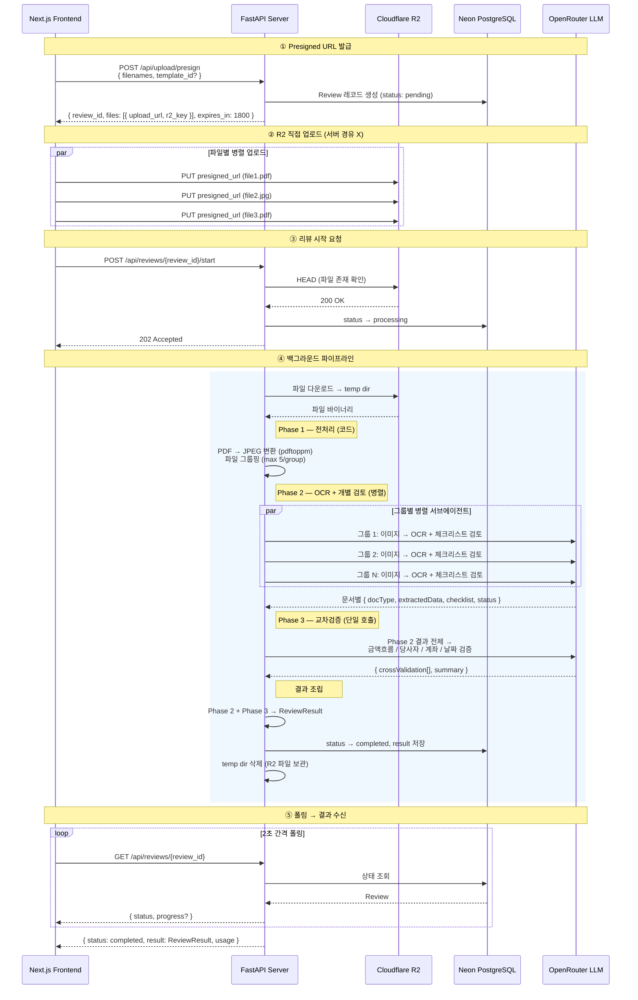
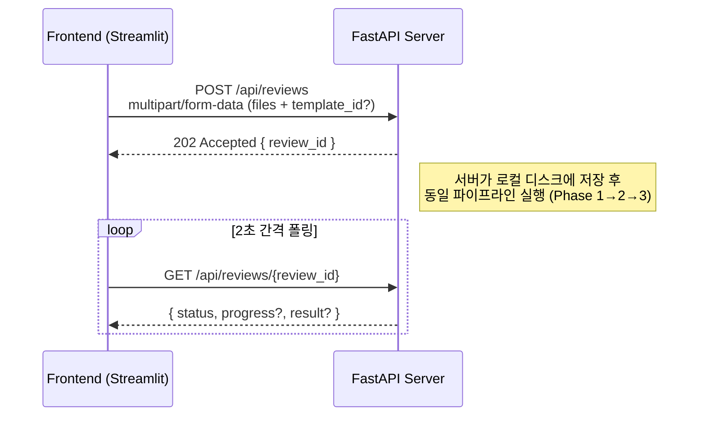

# API Specification — KR Document Review API

> **Version**: 0.1.0
> **Last updated**: 2026-02-17
> **Source of truth**: FastAPI server in `app/`

---

## 1. Overview

### Base URL

| Environment | URL |
|---|---|
| Local development | `http://localhost:8000` |
| Production | Configured per deployment |

### Conventions

- **Content-Type**: `application/json` for all endpoints except file upload (`multipart/form-data`)
- **Date format**: ISO 8601 strings (e.g., `"2026-02-17T09:30:00.000000"`)
- **IDs**: UUID v4 strings
- **Pagination**: `limit` / `offset` query parameters
- **Null vs absent**: Optional fields that are `null` may be omitted from the response

---

## 2. Authentication

All endpoints except `GET /health`, `POST /api/auth/register`, `POST /api/auth/login`, `GET /api/auth/google/authorize`, and `GET /api/auth/google/callback` require authentication.

### 2.1 JWT Bearer Token

Issued on register, login, or Google OAuth callback.

| Property | Value |
|---|---|
| Header | `Authorization: Bearer <token>` |
| Algorithm | HS256 |
| Audience | `fastapi-users:auth` |
| Lifetime | 1440 minutes (24 hours) |
| Payload `sub` | User ID (UUID string) |

### 2.2 API Key

Issued via the API Key management endpoints. Sent as a header:

```
X-API-Key: <raw-key>
```

Keys are stored as SHA-256 hashes server-side. On each use, `last_used` is updated.

### 2.3 Google OAuth Flow

1. Client calls `GET /api/auth/google/authorize` → receives `{ "authorization_url": "..." }`
2. Client redirects user to Google's authorization URL (scopes: `openid`, `email`, `profile`)
3. Google redirects to `GET /api/auth/google/callback?code=<code>`
4. Server exchanges code for token, creates/finds user, generates JWT
5. Server redirects to `{STREAMLIT_URL}?token=<jwt>` (for SPA: frontend reads `token` from query param)

### 2.4 Auth Priority

The `get_current_user` dependency checks in order:

1. **JWT Bearer** — decoded from `Authorization: Bearer <token>` header
2. **API Key** — looked up via `X-API-Key` header

If neither produces a valid active user → `401 Unauthorized`.

---

## 3. Endpoints

### 3.1 Health

#### `GET /health`

Health check. No authentication required.

**Response** `200 OK`

```json
{
  "status": "ok",       // "ok" | "degraded"
  "db": "ok"            // "ok" | "error"
}
```

---

### 3.2 Auth

#### `POST /api/auth/register`

Create a new user account and receive a JWT.

**Auth**: None

**Request body** `application/json`

| Field | Type | Required | Description |
|---|---|---|---|
| `email` | string | Yes | User email address |
| `password` | string | Yes | Password |
| `name` | string | Yes | Display name |

**Response** `201 Created`

```json
{
  "token": "eyJhbGciOiJIUzI1NiIs...",
  "token_type": "bearer",
  "user": {
    "id": "550e8400-e29b-41d4-a716-446655440000",
    "email": "user@example.com",
    "name": "John",
    "is_active": true,
    "created_at": "2026-02-17T09:00:00"
  }
}
```

**Errors**

| Status | Detail |
|---|---|
| 409 Conflict | `"Email already registered"` |
| 422 Unprocessable Entity | Validation error (missing/invalid fields) |

---

#### `POST /api/auth/login`

Authenticate with email and password.

**Auth**: None

**Request body** `application/json`

| Field | Type | Required | Description |
|---|---|---|---|
| `email` | string | Yes | User email address |
| `password` | string | Yes | Password |

**Response** `200 OK`

```json
{
  "token": "eyJhbGciOiJIUzI1NiIs...",
  "token_type": "bearer",
  "user": {
    "id": "550e8400-e29b-41d4-a716-446655440000",
    "email": "user@example.com",
    "name": "John",
    "is_active": true,
    "created_at": "2026-02-17T09:00:00"
  }
}
```

**Errors**

| Status | Detail |
|---|---|
| 401 Unauthorized | `"Invalid email or password"` |
| 401 Unauthorized | `"User is inactive"` |

---

#### `GET /api/auth/me`

Get the current authenticated user's profile.

**Auth**: JWT or API Key

**Response** `200 OK`

```json
{
  "id": "550e8400-e29b-41d4-a716-446655440000",
  "email": "user@example.com",
  "name": "John",
  "is_active": true,
  "created_at": "2026-02-17T09:00:00"
}
```

**Errors**

| Status | Detail |
|---|---|
| 401 Unauthorized | `"Invalid or missing credentials"` |

---

#### `GET /api/auth/google/authorize`

Get the Google OAuth authorization URL.

**Auth**: None

**Response** `200 OK`

```json
{
  "authorization_url": "https://accounts.google.com/o/oauth2/v2/auth?..."
}
```

---

#### `GET /api/auth/google/callback`

Google OAuth callback endpoint. Not called directly by the frontend.

**Auth**: None

**Query params**

| Param | Type | Required | Description |
|---|---|---|---|
| `code` | string | Yes | Authorization code from Google |

**Response** `307 Temporary Redirect`

Redirects to `{STREAMLIT_URL}?token=<jwt>`. For SPA integration, the frontend URL should be configured via `STREAMLIT_URL` environment variable (to be renamed for non-Streamlit frontends).

**Errors**

| Status | Detail |
|---|---|
| 400 Bad Request | `"Failed to exchange OAuth code for token"` |
| 400 Bad Request | `"Failed to fetch Google user info"` |

---

### 3.3 File Upload (Presigned URL)

#### `POST /api/upload/presign`

Generate presigned PUT URLs for direct upload to R2 (Cloudflare S3-compatible storage). Creates a review record in `pending` status. After uploading files to the returned URLs, call `POST /api/reviews/{review_id}/start` to begin processing.

**Auth**: JWT or API Key

**Request body** `application/json`

| Field | Type | Required | Description |
|---|---|---|---|
| `filenames` | string[] | Yes | List of filenames to upload |
| `template_id` | string | No | ID of a saved rule template to apply |
| `custom_rules` | string (JSON) | No | Inline custom rules as JSON string |

> `template_id` and `custom_rules` are mutually exclusive. If `template_id` is provided, it takes precedence.

**Response** `200 OK`

```json
{
  "review_id": "REV-20260217-A1B2C3",
  "files": [
    {
      "filename": "invoice.pdf",
      "upload_url": "https://<account>.r2.cloudflarestorage.com/bucket/uploads/user-id/review-id/invoice.pdf?X-Amz-...",
      "r2_key": "uploads/user-id/review-id/invoice.pdf"
    }
  ],
  "expires_in": 1800
}
```

**Errors**

| Status | Detail |
|---|---|
| 401 Unauthorized | `"Invalid or missing credentials"` |
| 404 Not Found | `"Template not found"` (invalid `template_id`) |
| 422 Unprocessable Entity | `"Invalid custom_rules JSON"` |

**Client upload flow:**

```typescript
// 1. Get presigned URLs
const { review_id, files } = await api.post('/api/upload/presign', {
  filenames: ['invoice.pdf', 'license.jpg'],
  template_id: selectedTemplate,
});

// 2. Upload each file directly to R2 (parallel)
await Promise.all(
  files.map(({ upload_url }, i) =>
    fetch(upload_url, { method: 'PUT', body: fileObjects[i] })
  )
);

// 3. Start review processing
await api.post(`/api/reviews/${review_id}/start`);
```

---

#### `POST /api/reviews/{review_id}/start`

Start processing a review after files have been uploaded to R2 via presigned URLs. Verifies that all files exist in R2, then transitions the review from `pending` to `processing`.

**Auth**: JWT or API Key

**Path params**

| Param | Type | Description |
|---|---|---|
| `review_id` | string | The review UUID (from presign response) |

**Response** `202 Accepted`

```json
{
  "review_id": "REV-20260217-A1B2C3",
  "status": "processing",
  "file_count": 2,
  "created_at": "2026-02-17T09:30:00.000000",
  "estimated_seconds": 120
}
```

**Errors**

| Status | Detail |
|---|---|
| 400 Bad Request | `"No R2 files associated with review"` |
| 400 Bad Request | `"Some files have not been uploaded to R2"` |
| 401 Unauthorized | `"Invalid or missing credentials"` |
| 404 Not Found | `"Review not found"` |
| 409 Conflict | `"Review is already processing"` (or completed/failed) |

---

### 3.4 Reviews

#### `POST /api/reviews`

Upload documents and start a review job via multipart form data. Returns immediately with `202 Accepted`; the review runs in the background.

> **Note**: This is the legacy upload path retained for backward compatibility (e.g., Streamlit UI). For new frontends, prefer the presigned URL flow (`POST /api/upload/presign` → R2 upload → `POST /api/reviews/{id}/start`).

**Auth**: JWT or API Key

**Request** `multipart/form-data`

| Field | Type | Required | Description |
|---|---|---|---|
| `files` | File[] | Yes | One or more document files to review |
| `template_id` | string | No | ID of a saved rule template to apply |
| `custom_rules` | string (JSON) | No | Inline custom rules as JSON string |

> `template_id` and `custom_rules` are mutually exclusive. If `template_id` is provided, it takes precedence.

**`custom_rules` JSON shape** (when provided inline):

```json
{
  "mode": "supplement",           // "supplement" | "replace"
  "phase2_checklists": [          // optional
    {
      "doc_type": "사업자등록증",
      "checklist_md": "- [ ] 사업자번호 확인\n- [ ] 대표자명 확인"
    }
  ],
  "cross_validation_rules": "..."  // optional, markdown string
}
```

**Response** `202 Accepted`

```json
{
  "review_id": "a1b2c3d4-e5f6-7890-abcd-ef1234567890",
  "status": "processing",
  "file_count": 3,
  "created_at": "2026-02-17T09:30:00.000000",
  "estimated_seconds": 120
}
```

**Errors**

| Status | Detail |
|---|---|
| 401 Unauthorized | `"Invalid or missing credentials"` |
| 404 Not Found | `"Template not found"` (invalid `template_id`) |
| 422 Unprocessable Entity | `"Invalid custom_rules JSON"` |

---

#### `GET /api/reviews/{review_id}`

Poll review status and retrieve results.

**Auth**: JWT or API Key

**Path params**

| Param | Type | Description |
|---|---|---|
| `review_id` | string | The review UUID |

**Response** `200 OK`

The response shape varies based on the review `status`:

**When `status` = `"processing"`:**

```json
{
  "review_id": "a1b2c3d4-...",
  "status": "processing",
  "progress": {
    "phase": "phase2_extraction",
    "detail": "사업자등록증 분석 중...",
    "completed_groups": 2,
    "total_groups": 5
  },
  "result": null,
  "usage": null,
  "error": null
}
```

**When `status` = `"completed"`:**

```json
{
  "review_id": "a1b2c3d4-...",
  "status": "completed",
  "progress": null,
  "result": { /* ReviewResult — see §4 */ },
  "usage": {
    "total_input_tokens": 15230,
    "total_output_tokens": 4200,
    "estimated_cost_usd": 0.045,
    "duration_seconds": 87.3
  },
  "error": null
}
```

**When `status` = `"failed"`:**

```json
{
  "review_id": "a1b2c3d4-...",
  "status": "failed",
  "progress": null,
  "result": null,
  "usage": null,
  "error": "LLM call failed: connection timeout"
}
```

**Conditional fields summary:**

| Field | `processing` | `completed` | `failed` |
|---|---|---|---|
| `progress` | Present | `null` | `null` |
| `result` | `null` | Present | `null` |
| `usage` | `null` | Present | `null` |
| `error` | `null` | `null` | Present |

**Errors**

| Status | Detail |
|---|---|
| 401 Unauthorized | `"Invalid or missing credentials"` |
| 404 Not Found | `"Review not found"` |

---

#### `GET /api/reviews`

List reviews for the authenticated user, with pagination and optional status filter.

**Auth**: JWT or API Key

**Query params**

| Param | Type | Default | Constraints | Description |
|---|---|---|---|---|
| `limit` | int | 20 | 1–100 | Page size |
| `offset` | int | 0 | ≥ 0 | Number of items to skip |
| `status` | string | `null` | `"pending"` \| `"processing"` \| `"completed"` \| `"failed"` | Filter by status |

**Response** `200 OK`

```json
{
  "reviews": [
    {
      "review_id": "a1b2c3d4-...",
      "status": "completed",
      "progress": null,
      "result": { /* ReviewResult */ },
      "usage": { /* Usage */ },
      "error": null
    }
  ],
  "total": 42
}
```

Each item in `reviews` follows the same conditional field rules as `GET /api/reviews/{id}`.

**Errors**

| Status | Detail |
|---|---|
| 401 Unauthorized | `"Invalid or missing credentials"` |
| 422 Unprocessable Entity | Invalid query parameter values |

---

#### `DELETE /api/reviews/{review_id}`

Delete a review and its associated files (both local and R2).

**Auth**: JWT or API Key

**Path params**

| Param | Type | Description |
|---|---|---|
| `review_id` | string | The review UUID |

**Response** `200 OK`

```json
{
  "detail": "Review deleted"
}
```

**Errors**

| Status | Detail |
|---|---|
| 401 Unauthorized | `"Invalid or missing credentials"` |
| 404 Not Found | `"Review not found"` |

---

### 3.5 Chat

#### `POST /api/chat`

Send a chat message, optionally referencing a completed review for context.

**Auth**: JWT or API Key

**Request body** `application/json`

| Field | Type | Required | Description |
|---|---|---|---|
| `message` | string | Yes | The user's message |
| `history` | ChatMessage[] | No | Previous conversation turns (default: `[]`) |
| `review_id` | string | No | Review ID to use as context |

**`ChatMessage` shape:**

```json
{
  "role": "user",       // "user" | "assistant"
  "content": "..."
}
```

**Response** `200 OK`

```json
{
  "reply": "검토 결과에 따르면...",
  "usage": {
    "total_input_tokens": 1500,
    "total_output_tokens": 300,
    "estimated_cost_usd": 0.0,
    "duration_seconds": 0.0
  }
}
```

**Errors**

| Status | Detail |
|---|---|
| 401 Unauthorized | `"Invalid or missing credentials"` |
| 404 Not Found | `"Review not found"` (invalid `review_id`) |
| 500 Internal Server Error | `"OPENROUTER_API_KEY not configured"` |
| 502 Bad Gateway | `"LLM call failed: <error>"` |

---

### 3.6 API Keys

#### `POST /api/auth/api-keys`

Create a new API key. The raw key is returned **only once** in the response.

**Auth**: JWT or API Key

**Request body** `application/json`

| Field | Type | Required | Description |
|---|---|---|---|
| `name` | string | Yes | A human-readable label for the key |

**Response** `201 Created`

```json
{
  "id": "key-uuid-here",
  "name": "My integration key",
  "key": "dck_a1b2c3d4e5f6...",
  "key_prefix": "dck_a1b2",
  "created_at": "2026-02-17T10:00:00",
  "expires_at": null
}
```

> **Important**: The `key` field contains the full raw API key. It is only returned at creation time and cannot be retrieved again.

**Errors**

| Status | Detail |
|---|---|
| 401 Unauthorized | `"Invalid or missing credentials"` |

---

#### `GET /api/auth/api-keys`

List all API keys for the authenticated user. Does **not** return the raw key.

**Auth**: JWT or API Key

**Response** `200 OK`

```json
[
  {
    "id": "key-uuid-here",
    "name": "My integration key",
    "key_prefix": "dck_a1b2",
    "is_active": true,
    "last_used": "2026-02-17T12:00:00",
    "created_at": "2026-02-17T10:00:00",
    "expires_at": null
  }
]
```

**Errors**

| Status | Detail |
|---|---|
| 401 Unauthorized | `"Invalid or missing credentials"` |

---

#### `DELETE /api/auth/api-keys/{key_id}`

Revoke (delete) an API key.

**Auth**: JWT or API Key

**Path params**

| Param | Type | Description |
|---|---|---|
| `key_id` | string | The API key UUID |

**Response** `200 OK`

```json
{
  "detail": "API key revoked"
}
```

**Errors**

| Status | Detail |
|---|---|
| 401 Unauthorized | `"Invalid or missing credentials"` |
| 404 Not Found | `"API key not found"` |

---

### 3.7 Rule Templates

#### `POST /api/rule-templates`

Create a new rule template.

**Auth**: JWT or API Key

**Request body** `application/json`

| Field | Type | Required | Description |
|---|---|---|---|
| `name` | string | Yes | Template name |
| `description` | string | No | Template description |
| `rules` | object | Yes | Rules configuration (stored as JSON) |

**Response** `201 Created`

```json
{
  "id": "tmpl-uuid-here",
  "name": "부동산 계약서 검토",
  "description": "부동산 관련 서류 검토 규칙",
  "rules": {
    "mode": "supplement",
    "phase2_checklists": [...],
    "cross_validation_rules": "..."
  },
  "created_at": "2026-02-17T10:00:00",
  "updated_at": "2026-02-17T10:00:00"
}
```

**Errors**

| Status | Detail |
|---|---|
| 401 Unauthorized | `"Invalid or missing credentials"` |
| 422 Unprocessable Entity | Validation error |

---

#### `GET /api/rule-templates`

List all rule templates for the authenticated user.

**Auth**: JWT or API Key

**Response** `200 OK`

```json
[
  {
    "id": "tmpl-uuid-here",
    "name": "부동산 계약서 검토",
    "description": "부동산 관련 서류 검토 규칙",
    "rules": { ... },
    "created_at": "2026-02-17T10:00:00",
    "updated_at": "2026-02-17T10:00:00"
  }
]
```

---

#### `GET /api/rule-templates/{template_id}`

Get a single rule template by ID.

**Auth**: JWT or API Key

**Path params**

| Param | Type | Description |
|---|---|---|
| `template_id` | string | The template UUID |

**Response** `200 OK`

```json
{
  "id": "tmpl-uuid-here",
  "name": "부동산 계약서 검토",
  "description": "...",
  "rules": { ... },
  "created_at": "2026-02-17T10:00:00",
  "updated_at": "2026-02-17T10:00:00"
}
```

**Errors**

| Status | Detail |
|---|---|
| 401 Unauthorized | `"Invalid or missing credentials"` |
| 404 Not Found | `"Template not found"` |

---

#### `PUT /api/rule-templates/{template_id}`

Update an existing rule template. All fields are optional — only provided fields are updated.

**Auth**: JWT or API Key

**Path params**

| Param | Type | Description |
|---|---|---|
| `template_id` | string | The template UUID |

**Request body** `application/json`

| Field | Type | Required | Description |
|---|---|---|---|
| `name` | string | No | New template name |
| `description` | string | No | New description |
| `rules` | object | No | New rules configuration |

**Response** `200 OK`

Returns the updated `TemplateResponse` (same shape as `POST`).

**Errors**

| Status | Detail |
|---|---|
| 401 Unauthorized | `"Invalid or missing credentials"` |
| 404 Not Found | `"Template not found"` |

---

#### `DELETE /api/rule-templates/{template_id}`

Delete a rule template.

**Auth**: JWT or API Key

**Path params**

| Param | Type | Description |
|---|---|---|
| `template_id` | string | The template UUID |

**Response** `200 OK`

```json
{
  "detail": "Template deleted"
}
```

**Errors**

| Status | Detail |
|---|---|
| 401 Unauthorized | `"Invalid or missing credentials"` |
| 404 Not Found | `"Template not found"` |

---

## 4. Data Models

### Auth Models

#### `UserResponse`

```typescript
{
  id: string           // UUID
  email: string
  name: string
  is_active: boolean
  created_at: string   // ISO 8601
}
```

#### `TokenResponse`

```typescript
{
  token: string         // JWT string
  token_type: "bearer"
  user: UserResponse
}
```

### Upload Models

#### `PresignedUrlRequest`

```typescript
{
  filenames: string[]            // list of filenames to upload
  template_id: string | null     // optional rule template ID
  custom_rules: string | null    // optional JSON string
}
```

#### `PresignedUrlItem`

```typescript
{
  filename: string       // original filename
  upload_url: string     // presigned PUT URL (expires in 30 min)
  r2_key: string         // R2 object key
}
```

#### `PresignedUrlResponse`

```typescript
{
  review_id: string              // created review ID
  files: PresignedUrlItem[]
  expires_in: 1800               // seconds until URLs expire
}
```

### Review Models

#### `ReviewCreateResponse`

```typescript
{
  review_id: string       // UUID
  status: "processing"
  file_count: number
  created_at: string      // ISO 8601 datetime
  estimated_seconds: 120  // default estimate
}
```

#### `ReviewStatusResponse`

```typescript
{
  review_id: string
  status: "pending" | "processing" | "completed" | "failed"
  progress: ReviewProgress | null
  result: ReviewResult | null
  usage: Usage | null
  error: string | null
}
```

#### `ReviewListResponse`

```typescript
{
  reviews: ReviewStatusResponse[]
  total: number
}
```

#### `ReviewProgress`

```typescript
{
  phase: string              // e.g. "phase2_extraction", "phase3_cross_validation", "completed", "failed"
  detail: string             // human-readable progress text (Korean)
  completed_groups: number   // number of doc groups processed
  total_groups: number       // total doc groups to process
}
```

#### `ReviewResult`

```typescript
{
  meta: Record<string, any>       // pipeline metadata
  documents: DocumentResult[]
  cross_validation: CrossValidationItem[]
  summary: ReviewSummary
}
```

#### `DocumentResult`

```typescript
{
  doc_type: string                     // e.g. "사업자등록증", "통장사본"
  filename: string
  extracted_data: Record<string, any>  // key-value pairs extracted from the document
  checklist: ChecklistItem[]           // individual checklist results
  status: "pass" | "warning" | "fail"
}
```

Each item in `checklist` is:

```typescript
{
  item: string        // checklist item description
  status: string      // "pass" | "warning" | "fail"
  detail: string      // explanation
  [key: string]: any  // additional fields may vary
}
```

#### `CrossValidationItem`

```typescript
{
  check_type: string      // e.g. "name_match", "address_match"
  description: string     // what was checked
  status: "pass" | "warning" | "fail"
  details: string         // explanation of result
}
```

#### `ReviewSummary`

```typescript
{
  total_docs: number
  passed: number
  warnings: number
  failures: number
  critical_issues: string[]     // high-priority issues requiring attention
  action_required: string[]     // recommended actions
  opinion: string               // overall assessment text (Korean)
}
```

#### `Usage`

```typescript
{
  total_input_tokens: number
  total_output_tokens: number
  estimated_cost_usd: number
  duration_seconds: number
}
```

### Chat Models

#### `ChatMessage`

```typescript
{
  role: "user" | "assistant"
  content: string
}
```

#### `ChatRequest`

```typescript
{
  message: string
  history: ChatMessage[]   // default: []
  review_id: string | null // optional review context
}
```

#### `ChatResponse`

```typescript
{
  reply: string
  usage: Usage | null
}
```

### Custom Rules Models

#### `CustomRules`

```typescript
{
  mode: "supplement" | "replace"     // default: "supplement"
  phase2_checklists: CustomChecklist[] | null
  cross_validation_rules: string | null
}
```

#### `CustomChecklist`

```typescript
{
  doc_type: string        // document type identifier
  checklist_md: string    // checklist items in markdown format
}
```

### API Key Models

#### `ApiKeyCreateRequest`

```typescript
{
  name: string    // human-readable label
}
```

#### `ApiKeyCreateResponse`

```typescript
{
  id: string
  name: string
  key: string           // full raw key — only returned at creation
  key_prefix: string    // e.g. "dck_a1b2"
  created_at: string
  expires_at: string | null
}
```

#### `ApiKeyListItem`

```typescript
{
  id: string
  name: string
  key_prefix: string
  is_active: boolean
  last_used: string | null
  created_at: string
  expires_at: string | null
}
```

### Template Models

#### `TemplateCreateRequest`

```typescript
{
  name: string
  description: string | null
  rules: object           // arbitrary JSON rules configuration
}
```

#### `TemplateUpdateRequest`

```typescript
{
  name: string | null
  description: string | null
  rules: object | null
}
```

#### `TemplateResponse`

```typescript
{
  id: string
  name: string
  description: string | null
  rules: object
  created_at: string
  updated_at: string
}
```

---

## 5. Error Handling

### Standard Error Shape

All error responses follow this format:

```json
{
  "detail": "Human-readable error message"
}
```

For validation errors (422), FastAPI returns:

```json
{
  "detail": [
    {
      "loc": ["body", "email"],
      "msg": "field required",
      "type": "value_error.missing"
    }
  ]
}
```

### Status Code Reference

| Code | Meaning | When |
|---|---|---|
| 200 | OK | Successful GET, PUT, DELETE |
| 201 | Created | Successful POST (register, create API key, create template) |
| 202 | Accepted | Review created, processing started in background |
| 307 | Temporary Redirect | Google OAuth callback → frontend redirect |
| 400 | Bad Request | Invalid OAuth code or Google API failure |
| 401 | Unauthorized | Missing/invalid JWT or API key, inactive user |
| 404 | Not Found | Resource (review, template, API key) not found or not owned by user |
| 409 | Conflict | Email already registered |
| 422 | Unprocessable Entity | Request validation failed (invalid JSON, missing required fields, invalid param values) |
| 429 | Too Many Requests | Rate limit exceeded (30 requests/minute) |
| 500 | Internal Server Error | Server configuration errors (e.g., missing API key) |
| 502 | Bad Gateway | Upstream LLM call failed |

---

## 6. Middleware

### CORS

Configured in `app/main.py`:

| Setting | Value |
|---|---|
| `allow_origins` | Configured via `ALLOWED_ORIGINS` env (default: `["http://localhost:8501"]`) |
| `allow_credentials` | `true` |
| `allow_methods` | `["*"]` |
| `allow_headers` | `["*"]` |

For Next.js frontend, add the frontend origin to `ALLOWED_ORIGINS`.

### Rate Limiting

In-memory sliding window rate limiter (`RateLimitMiddleware`).

| Setting | Value |
|---|---|
| Window | 60 seconds (sliding) |
| Max requests | 30 per window (configurable via `RATE_LIMIT_PER_MINUTE`) |
| Identity | JWT token prefix → API key prefix → client IP |

**429 response:**

```json
{
  "detail": "Rate limit exceeded. Try again later."
}
```

### Request ID

Every request gets a unique `X-Request-ID` header (`RequestIDMiddleware`).

- If the client sends `X-Request-ID`, the server uses that value
- Otherwise, the server generates a UUID v4
- The value is echoed back in the response `X-Request-ID` header
- Available in request state as `request.state.request_id`

---

## 7. Frontend Integration Patterns

### 7.1 Architecture — Upload & Review Pipeline



### 7.1b Legacy Multipart Upload



### 7.2 Polling Pattern

Recommended implementation for the frontend:

```typescript
async function pollReview(reviewId: string): Promise<ReviewStatusResponse> {
  const POLL_INTERVAL = 2000; // 2 seconds

  while (true) {
    const res = await fetch(`/api/reviews/${reviewId}`, {
      headers: { Authorization: `Bearer ${token}` },
    });
    const data = await res.json();

    if (data.status === "completed" || data.status === "failed") {
      return data;
    }

    // Update progress UI from data.progress
    // { phase, detail, completed_groups, total_groups }

    await new Promise((r) => setTimeout(r, POLL_INTERVAL));
  }
}
```

**Status transitions:**

```
pending → processing → completed
                    ↘ failed
```

### 7.3 OAuth Redirect Flow for SPA

For a Next.js (or other SPA) frontend:

1. Frontend calls `GET /api/auth/google/authorize`
2. Frontend redirects to the `authorization_url` from the response
3. After Google auth, user is redirected to `GET /api/auth/google/callback?code=...`
4. Server processes callback and redirects to `{STREAMLIT_URL}?token=<jwt>`
5. Frontend reads `token` from the URL query parameter on its landing page
6. Frontend stores the JWT (e.g., in `localStorage` or a cookie) and removes it from the URL

**Configuration**: Set `STREAMLIT_URL` environment variable to the SPA's callback URL (e.g., `https://app.example.com/auth/callback`).

### 7.4 File Upload Example (Presigned URL — recommended)

```typescript
async function uploadReview(files: File[], templateId?: string) {
  // 1. Get presigned URLs
  const presignRes = await fetch("/api/upload/presign", {
    method: "POST",
    headers: {
      Authorization: `Bearer ${token}`,
      "Content-Type": "application/json",
    },
    body: JSON.stringify({
      filenames: files.map((f) => f.name),
      template_id: templateId,
    }),
  });
  const { review_id, files: presignedFiles } = await presignRes.json();

  // 2. Upload files directly to R2 (parallel)
  await Promise.all(
    presignedFiles.map(({ upload_url }: { upload_url: string }, i: number) =>
      fetch(upload_url, { method: "PUT", body: files[i] })
    )
  );

  // 3. Start review processing
  const startRes = await fetch(`/api/reviews/${review_id}/start`, {
    method: "POST",
    headers: { Authorization: `Bearer ${token}` },
  });

  if (startRes.status === 202) {
    return review_id; // start polling
  }
}
```

### 7.4b File Upload Example (Legacy multipart)

```typescript
async function uploadReviewLegacy(files: File[], templateId?: string) {
  const formData = new FormData();
  files.forEach((file) => formData.append("files", file));
  if (templateId) {
    formData.append("template_id", templateId);
  }

  const res = await fetch("/api/reviews", {
    method: "POST",
    headers: { Authorization: `Bearer ${token}` },
    // Do NOT set Content-Type — browser sets it with boundary
    body: formData,
  });

  if (res.status === 202) {
    const data = await res.json();
    return data.review_id; // start polling
  }
}
```

---

## Appendix: Endpoint Summary Table

| # | Method | Path | Auth | Status | Description |
|---|---|---|---|---|---|
| 1 | GET | `/health` | No | 200 | Health check |
| 2 | POST | `/api/auth/register` | No | 201 | Register new user |
| 3 | POST | `/api/auth/login` | No | 200 | Login with email/password |
| 4 | GET | `/api/auth/me` | Yes | 200 | Get current user profile |
| 5 | GET | `/api/auth/google/authorize` | No | 200 | Get Google OAuth URL |
| 6 | GET | `/api/auth/google/callback` | No | 307 | Google OAuth callback |
| 7 | POST | `/api/upload/presign` | Yes | 200 | Get presigned R2 upload URLs |
| 8 | POST | `/api/reviews/{id}/start` | Yes | 202 | Start review after R2 upload |
| 9 | POST | `/api/reviews` | Yes | 202 | Create review (legacy multipart upload) |
| 10 | GET | `/api/reviews/{id}` | Yes | 200 | Get review status/result |
| 11 | GET | `/api/reviews` | Yes | 200 | List reviews (paginated) |
| 12 | DELETE | `/api/reviews/{id}` | Yes | 200 | Delete a review (local + R2) |
| 13 | POST | `/api/chat` | Yes | 200 | Chat with optional review context |
| 14 | POST | `/api/auth/api-keys` | Yes | 201 | Create API key |
| 15 | GET | `/api/auth/api-keys` | Yes | 200 | List API keys |
| 16 | DELETE | `/api/auth/api-keys/{id}` | Yes | 200 | Revoke API key |
| 17 | POST | `/api/rule-templates` | Yes | 201 | Create rule template |
| 18 | GET | `/api/rule-templates` | Yes | 200 | List rule templates |
| 19 | GET | `/api/rule-templates/{id}` | Yes | 200 | Get rule template |
| 20 | PUT | `/api/rule-templates/{id}` | Yes | 200 | Update rule template |
| 21 | DELETE | `/api/rule-templates/{id}` | Yes | 200 | Delete rule template |
