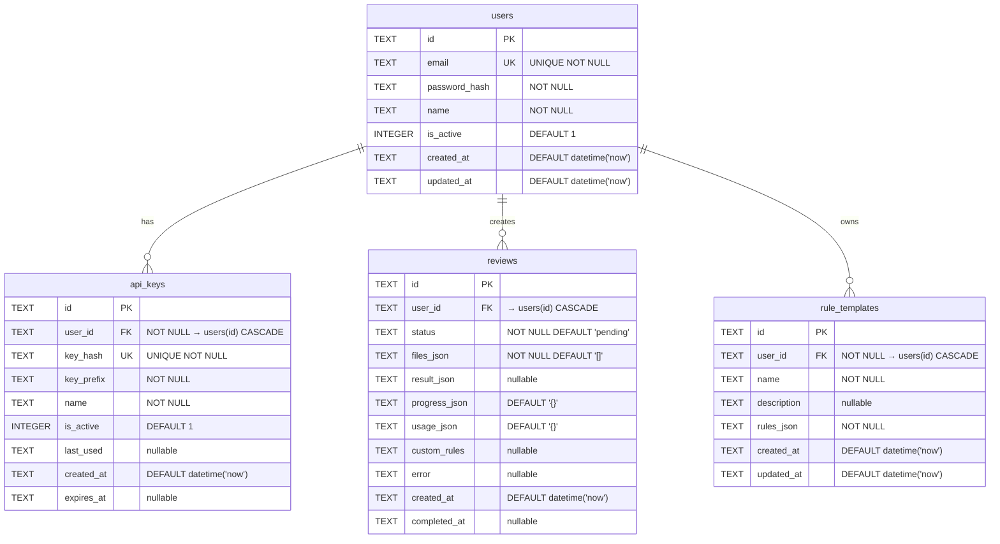

# 데이터베이스 스펙

## 1. 5W1H — 설계 근거

### 1.1 Who — 누가 사용하는가

| 액터 | 설명 |
|------|------|
| **최종 사용자** | 정부 지원사업 정산 담당자. UI를 통해 서류를 업로드하고 검토 결과를 확인한다 |
| **API 소비자** | API 키를 발급받아 외부 시스템에서 검토 요청을 보내는 개발자/시스템 |
| **시스템 내부** | 파이프라인이 리뷰 상태를 업데이트하고, 결과를 저장한다 |

**멀티테넌트 격리 모델**: 모든 데이터 접근은 `user_id` 기반으로 필터링된다. 사용자는 자신의 리뷰, API 키, 규칙 템플릿만 조회/수정/삭제할 수 있다. DB 레벨 RLS(Row-Level Security)가 아닌 애플리케이션 레벨에서 격리를 보장한다.

### 1.2 What — 무엇을 저장하는가

4개 핵심 테이블 + 1개 시스템 테이블:

| 테이블 | 역할 |
|--------|------|
| `users` | 사용자 계정 (이메일, 비밀번호 해시, 이름) |
| `api_keys` | 사용자별 API 인증 키 (해시 저장) |
| `reviews` | 서류 검토 요청 및 결과 (파일 목록, 검토 결과, 진행 상황, 사용량) |
| `rule_templates` | 사용자 정의 검토 규칙 템플릿 |
| `_migrations` | 적용된 마이그레이션 추적 (시스템 테이블) |

### 1.3 When — 데이터 생명주기

#### 레코드 생성 시점

| 테이블 | 생성 시점 |
|--------|-----------|
| `users` | 회원가입 시 |
| `api_keys` | 사용자가 API 키 발급 요청 시 |
| `reviews` | 서류 업로드 후 검토 요청 시 |
| `rule_templates` | 사용자가 커스텀 규칙 저장 시 |

#### 리뷰 상태 전이

```
pending → processing → completed
                    ↘ failed
```

| 상태 | 의미 | 전이 조건 |
|------|------|-----------|
| `pending` | 검토 요청 접수됨 | 초기 생성 시 |
| `processing` | 파이프라인 실행 중 | 백그라운드 태스크 시작 시 |
| `completed` | 검토 완료 | 모든 Phase 정상 완료 시 |
| `failed` | 검토 실패 | 파이프라인 에러 발생 시 |

#### 데이터 보존

- 현재 TTL/자동 삭제 정책 없음 (MVP 단계)
- 업로드된 파일은 `uploads/` 디렉토리에 디스크 저장
- 사용자 삭제 시 CASCADE로 관련 데이터 일괄 삭제

### 1.4 Where — 어디에 저장하는가

| 항목 | 로컬 개발 (SQLite) | 프로덕션 (Neon PostgreSQL) |
|------|-------------------|--------------------------|
| **DBMS** | SQLite 3 | Neon PostgreSQL (serverless) |
| **연결 방식** | 파일: `data/reviews.db` | `DATABASE_URL` 환경변수 |
| **ORM** | SQLAlchemy 2.0 (Async) | SQLAlchemy 2.0 (Async) |
| **드라이버** | `aiosqlite` | `asyncpg` |
| **마이그레이션** | Legacy SQL + Alembic (batch) | Alembic (standard) |
| **커넥션 풀** | 없음 (파일 기반) | `pool_pre_ping=True`, pool_size=5 |
| **업로드 파일** | `uploads/` 디렉토리 (디스크) | `uploads/` 디렉토리 (디스크) |

### 1.5 Why — 왜 이렇게 설계했는가

#### SQLite를 선택한 이유

| 고려사항 | SQLite | PostgreSQL |
|----------|--------|------------|
| 운영 복잡도 | 제로 (파일 하나) | 별도 서버 운영 필요 |
| 배포 | 앱과 함께 배포 | 별도 인프라 필요 |
| 동시성 | WAL 모드로 읽기 동시성 확보 | 네이티브 MVCC |
| 확장성 | 단일 노드 제한 | 수평 확장 가능 |
| **결론** | **MVP에 적합 — 제로 운영 비용** | 스케일 아웃 필요 시 전환 |

#### JSON 컬럼을 사용하는 이유

`reviews` 테이블의 `files_json`, `result_json`, `progress_json`, `usage_json`과 `rule_templates`의 `rules_json`은 TEXT 컬럼에 JSON 문자열로 저장한다.

- **복잡한 중첩 구조**: 검토 결과(`ReviewResult`)는 문서별 체크리스트, 교차검증 항목, 요약 등 깊이 있는 트리 구조. 이를 정규화하면 테이블 수가 과도하게 증가
- **읽기/쓰기 패턴**: 항상 전체를 한 번에 읽고/쓴다. 부분 업데이트가 필요 없음
- **Pydantic 통합**: `model_dump_json()` / `model_validate_json()`으로 직렬화/역직렬화가 깔끔

#### TEXT 기본키 (UUID)를 사용하는 이유

- 분산 환경에서도 충돌 없는 ID 생성 (`uuid.uuid4()`)
- 리뷰 ID는 `REV-{YYYYMMDD}-{NNN}` 형식의 사람이 읽기 쉬운 포맷 사용
- 외부 노출에 안전 (순차 정수는 열거 공격에 취약)

#### 인증 방식 설계 이유

| 항목 | 방식 | 이유 |
|------|------|------|
| 비밀번호 | bcrypt (passlib) | 업계 표준, 자동 솔트, 적응형 비용 |
| API 키 | SHA256 해시 | 빠른 조회 필요, 원본 복원 불필요 |
| 세션 | JWT (DB 미저장) | 무상태 인증, DB 조회 없이 검증 가능 |

### 1.6 How — 어떻게 구현했는가

#### Repository 패턴

```
routes.py / pipeline.py
        │
        ▼
    store.py (고수준 추상화 — Review 전용)
        │
        ▼
    repositories/ (ORM CRUD — BaseRepository 상속)
    ├── base.py          → BaseRepository(session: AsyncSession)
    ├── users.py         → UserRepository
    ├── api_keys.py      → ApiKeyRepository
    ├── reviews.py       → ReviewRepository
    └── templates.py     → TemplateRepository
        │
        ▼
    models.py (SQLAlchemy ORM 모델)
    ├── UserModel
    ├── ApiKeyModel
    ├── ReviewModel
    └── RuleTemplateModel
        │
        ▼
    connection.py (AsyncEngine + async_sessionmaker)
        │
        ▼
    sqlite+aiosqlite → data/reviews.db
```

- **`store.py`**: `ReviewRepository`를 래핑한 고수준 함수. 라우트/파이프라인에서 직접 호출
- **`models.py`**: SQLAlchemy ORM 모델 4개. `Base(DeclarativeBase)` 상속. 타임스탬프는 Python 레벨 기본값 사용
- **`repositories/`**: 각 테이블별 CRUD 클래스. `BaseRepository(AsyncSession)`를 상속받아 ORM 쿼리 사용
- **`connection.py`**: `create_async_engine` + `async_sessionmaker`로 세션 관리

#### ORM 모델 설계 원칙

- ORM 모델은 **영속성 전용** — API 레이어의 Pydantic 모델(`app/models.py`, `app/auth/models.py`)은 그대로 유지
- 두 레이어 간 변환은 Repository의 `_to_dict()` / `_model_to_review()` 메서드에서 처리
- 타임스탬프는 `String`(TEXT) 유지 — 기존 ISO 8601 문자열과 호환
- `is_active`는 `Integer` 유지 — SQLite 0/1 호환
- JSON 컬럼은 `Text` 유지 — 직렬화/역직렬화는 Repository에서 수동 처리

#### 커넥션 관리

```python
# 초기화 (앱 시작 시 1회)
await init_db()  # Engine 생성 + PRAGMA 이벤트 등록 + 마이그레이션 실행

# 사용 (요청마다)
async with get_db() as session:
    repo = ReviewRepository(session)
    review = await repo.get(review_id)

# 종료 (앱 종료 시)
await get_engine().dispose()
```

- `create_async_engine("sqlite+aiosqlite:///...")`로 엔진 생성
- `async_sessionmaker(engine, expire_on_commit=False)`로 세션 팩토리 생성
- `expire_on_commit=False` 필수 — async 환경에서 커밋 후 지연 로드 방지
- PRAGMA 설정은 `event.listen(engine.sync_engine, "connect", callback)`으로 커넥션 생성 시 자동 적용

#### 인덱싱 전략

| 인덱스 | 대상 컬럼 | 용도 |
|--------|-----------|------|
| `idx_reviews_user` | `reviews(user_id)` | 사용자별 리뷰 목록 조회 |
| `idx_reviews_status` | `reviews(status)` | 상태별 필터링 |
| `idx_reviews_created` | `reviews(created_at DESC)` | 최신순 정렬 |
| `idx_api_keys_hash` | `api_keys(key_hash)` | API 키 인증 시 해시 조회 |
| `idx_api_keys_user` | `api_keys(user_id)` | 사용자별 키 목록 |

#### CASCADE 삭제

- `api_keys.user_id` → `users(id) ON DELETE CASCADE`
- `reviews.user_id` → `users(id) ON DELETE CASCADE`
- `rule_templates.user_id` → `users(id) ON DELETE CASCADE`

사용자 삭제 시 해당 사용자의 모든 API 키, 리뷰, 규칙 템플릿이 함께 삭제된다.

---

## 2. 스키마 레퍼런스

### 2.1 ER 다이어그램



### 2.2 전체 DDL

> 소스: `app/db/migrations/001_initial.sql`

```sql
CREATE TABLE IF NOT EXISTS users (
    id            TEXT PRIMARY KEY,
    email         TEXT UNIQUE NOT NULL,
    password_hash TEXT NOT NULL,
    name          TEXT NOT NULL,
    is_active     INTEGER DEFAULT 1,
    created_at    TEXT DEFAULT (datetime('now')),
    updated_at    TEXT DEFAULT (datetime('now'))
);

CREATE TABLE IF NOT EXISTS api_keys (
    id          TEXT PRIMARY KEY,
    user_id     TEXT NOT NULL REFERENCES users(id) ON DELETE CASCADE,
    key_hash    TEXT UNIQUE NOT NULL,
    key_prefix  TEXT NOT NULL,
    name        TEXT NOT NULL,
    is_active   INTEGER DEFAULT 1,
    last_used   TEXT,
    created_at  TEXT DEFAULT (datetime('now')),
    expires_at  TEXT
);

CREATE TABLE IF NOT EXISTS reviews (
    id            TEXT PRIMARY KEY,
    user_id       TEXT REFERENCES users(id) ON DELETE CASCADE,
    status        TEXT NOT NULL DEFAULT 'pending',
    files_json    TEXT NOT NULL DEFAULT '[]',
    result_json   TEXT,
    progress_json TEXT DEFAULT '{}',
    usage_json    TEXT DEFAULT '{}',
    custom_rules  TEXT,
    error         TEXT,
    created_at    TEXT DEFAULT (datetime('now')),
    completed_at  TEXT
);

CREATE TABLE IF NOT EXISTS rule_templates (
    id          TEXT PRIMARY KEY,
    user_id     TEXT NOT NULL REFERENCES users(id) ON DELETE CASCADE,
    name        TEXT NOT NULL,
    description TEXT,
    rules_json  TEXT NOT NULL,
    created_at  TEXT DEFAULT (datetime('now')),
    updated_at  TEXT DEFAULT (datetime('now'))
);

-- 인덱스
CREATE INDEX IF NOT EXISTS idx_reviews_user ON reviews(user_id);
CREATE INDEX IF NOT EXISTS idx_reviews_status ON reviews(status);
CREATE INDEX IF NOT EXISTS idx_reviews_created ON reviews(created_at DESC);
CREATE INDEX IF NOT EXISTS idx_api_keys_hash ON api_keys(key_hash);
CREATE INDEX IF NOT EXISTS idx_api_keys_user ON api_keys(user_id);
```

### 2.3 시스템 테이블 — `_migrations`

```sql
CREATE TABLE IF NOT EXISTS _migrations (
    filename   TEXT PRIMARY KEY,
    applied_at TEXT DEFAULT (datetime('now'))
);
```

### 2.4 컬럼 상세 스펙

#### `users` 테이블

| 컬럼 | 타입 | NULL | 기본값 | 제약조건 | 설명 |
|-------|------|------|--------|----------|------|
| `id` | TEXT | NO | — | PK | UUID v4 (`uuid.uuid4()`) |
| `email` | TEXT | NO | — | UNIQUE | 로그인 이메일 |
| `password_hash` | TEXT | NO | — | — | bcrypt 해시 |
| `name` | TEXT | NO | — | — | 사용자 표시 이름 |
| `is_active` | INTEGER | YES | `1` | — | 활성 상태 (1=활성, 0=비활성) |
| `created_at` | TEXT | YES | `datetime('now')` | — | 생성 시각 (ISO 8601) |
| `updated_at` | TEXT | YES | `datetime('now')` | — | 수정 시각 (ISO 8601) |

#### `api_keys` 테이블

| 컬럼 | 타입 | NULL | 기본값 | 제약조건 | 설명 |
|-------|------|------|--------|----------|------|
| `id` | TEXT | NO | — | PK | UUID v4 |
| `user_id` | TEXT | NO | — | FK → `users(id)` CASCADE | 소유자 |
| `key_hash` | TEXT | NO | — | UNIQUE | SHA256 해시 |
| `key_prefix` | TEXT | NO | — | — | 키 접두사 (예: `dk_a1b2c3d4`) |
| `name` | TEXT | NO | — | — | 키 이름 (사용자 지정) |
| `is_active` | INTEGER | YES | `1` | — | 활성 상태 |
| `last_used` | TEXT | YES | `NULL` | — | 마지막 사용 시각 |
| `created_at` | TEXT | YES | `datetime('now')` | — | 생성 시각 |
| `expires_at` | TEXT | YES | `NULL` | — | 만료 시각 (NULL=무기한) |

#### `reviews` 테이블

| 컬럼 | 타입 | NULL | 기본값 | 제약조건 | 설명 |
|-------|------|------|--------|----------|------|
| `id` | TEXT | NO | — | PK | `REV-{YYYYMMDD}-{NNN}` 형식 |
| `user_id` | TEXT | YES | `NULL` | FK → `users(id)` CASCADE | 요청자 (익명 가능) |
| `status` | TEXT | NO | `'pending'` | — | 상태 (`pending`/`processing`/`completed`/`failed`) |
| `files_json` | TEXT | NO | `'[]'` | — | 업로드 파일 목록 (JSON 배열) |
| `result_json` | TEXT | YES | `NULL` | — | 검토 결과 (JSON 객체) |
| `progress_json` | TEXT | YES | `'{}'` | — | 진행 상황 (JSON 객체) |
| `usage_json` | TEXT | YES | `'{}'` | — | 토큰/비용 사용량 (JSON 객체) |
| `custom_rules` | TEXT | YES | `NULL` | — | 커스텀 검토 규칙 |
| `error` | TEXT | YES | `NULL` | — | 실패 시 에러 메시지 |
| `created_at` | TEXT | YES | `datetime('now')` | — | 생성 시각 |
| `completed_at` | TEXT | YES | `NULL` | — | 완료 시각 |

#### `rule_templates` 테이블

| 컬럼 | 타입 | NULL | 기본값 | 제약조건 | 설명 |
|-------|------|------|--------|----------|------|
| `id` | TEXT | NO | — | PK | UUID v4 |
| `user_id` | TEXT | NO | — | FK → `users(id)` CASCADE | 소유자 |
| `name` | TEXT | NO | — | — | 템플릿 이름 |
| `description` | TEXT | YES | `NULL` | — | 템플릿 설명 |
| `rules_json` | TEXT | NO | — | — | 규칙 정의 (JSON) |
| `created_at` | TEXT | YES | `datetime('now')` | — | 생성 시각 |
| `updated_at` | TEXT | YES | `datetime('now')` | — | 수정 시각 |

---

## 3. 데이터 모델 매핑

### 3.1 Pydantic 모델 ↔ DB 컬럼 매핑

#### Review 모델 (`app/models.py:Review`)

| Pydantic 필드 | DB 컬럼 | 변환 |
|----------------|---------|------|
| `review_id` | `id` | 직접 매핑 |
| `status` | `status` | `ReviewStatus.value` (문자열) |
| `files` | `files_json` | `json.dumps([f.model_dump() for f in files])` |
| `result` | `result_json` | `result.model_dump_json()` |
| `progress` | `progress_json` | `progress.model_dump_json()` |
| `usage` | `usage_json` | `usage.model_dump_json()` |
| `error` | `error` | 직접 매핑 |
| `created_at` | `created_at` | `datetime.isoformat()` |
| `completed_at` | `completed_at` | `datetime.isoformat()` 또는 `NULL` |

#### User 모델 (`app/auth/models.py:UserResponse`)

| Pydantic 필드 | DB 컬럼 | 변환 |
|----------------|---------|------|
| `id` | `id` | 직접 매핑 |
| `email` | `email` | 직접 매핑 |
| `name` | `name` | 직접 매핑 |
| `is_active` | `is_active` | `int` → `bool` |
| `created_at` | `created_at` | 직접 매핑 (문자열) |

### 3.2 JSON 컬럼 구조

#### `files_json` — 업로드 파일 목록

Pydantic 모델: `FileInfo` (`app/models.py`)

```json
[
  {
    "filename": "세금계산서_202401.pdf",
    "filepath": "uploads/abc123/세금계산서_202401.pdf",
    "content_type": "application/pdf",
    "size": 245760
  },
  {
    "filename": "통장사본.jpg",
    "filepath": "uploads/abc123/통장사본.jpg",
    "content_type": "image/jpeg",
    "size": 102400
  }
]
```

#### `result_json` — 검토 결과

Pydantic 모델: `ReviewResult` (`app/models.py`)

```json
{
  "meta": {
    "pipeline_version": "1.0",
    "model": "google/gemini-3-flash-preview"
  },
  "documents": [
    {
      "doc_type": "세금계산서",
      "filename": "세금계산서_202401.pdf",
      "extracted_data": {
        "공급가액": "10,000,000",
        "세액": "1,000,000",
        "사업자번호": "123-45-67890"
      },
      "checklist": [
        {
          "item": "공급가액과 세액 합계 일치",
          "status": "pass",
          "details": "11,000,000원 확인"
        },
        {
          "item": "사업자번호 유효성",
          "status": "pass",
          "details": "유효한 사업자번호"
        }
      ],
      "status": "pass"
    }
  ],
  "cross_validation": [
    {
      "check_type": "금액 교차검증",
      "description": "세금계산서 금액과 계약서 금액 일치 여부",
      "status": "pass",
      "details": "10,000,000원 일치"
    }
  ],
  "summary": {
    "total_docs": 3,
    "passed": 2,
    "warnings": 1,
    "failures": 0,
    "critical_issues": [],
    "action_required": ["통장사본 계좌번호 확인 필요"],
    "opinion": "전체적으로 양호하나 통장사본 계좌번호 재확인이 필요합니다."
  }
}
```

#### `progress_json` — 진행 상황

Pydantic 모델: `ReviewProgress` (`app/models.py`)

```json
{
  "phase": "phase2",
  "detail": "세금계산서 분석 중...",
  "completed_groups": 2,
  "total_groups": 5
}
```

#### `usage_json` — 토큰/비용 사용량

Pydantic 모델: `Usage` (`app/models.py`)

```json
{
  "total_input_tokens": 15420,
  "total_output_tokens": 3280,
  "estimated_cost_usd": 0.045,
  "duration_seconds": 23.5
}
```

#### `rules_json` (rule_templates) — 규칙 정의

Pydantic 모델: `CustomRules` / `CustomChecklist` (`app/models.py`)

```json
{
  "mode": "supplement",
  "phase2_checklists": [
    {
      "doc_type": "세금계산서",
      "checklist_md": "- [ ] 공급가액 확인\n- [ ] 사업자번호 유효성\n- [ ] 날짜 범위 확인"
    }
  ],
  "cross_validation_rules": "계약서 금액과 세금계산서 금액이 일치하는지 확인"
}
```

---

## 4. 데이터 접근 패턴

### 4.1 Repository 계층

| Repository | 테이블 | 주요 메서드 |
|------------|--------|-------------|
| `UserRepository` | `users` | `create`, `get_by_id`, `get_by_email` |
| `ApiKeyRepository` | `api_keys` | `create`, `get_by_id`, `list_by_user`, `delete` |
| `ReviewRepository` | `reviews` | `create`, `get`, `get_for_user`, `update`, `list`, `delete` |
| `TemplateRepository` | `rule_templates` | `create`, `get_by_id`, `get_for_user`, `list_by_user`, `update`, `delete` |

### 4.2 주요 쿼리 패턴

#### 인증 관련

| 쿼리 | 사용 인덱스 | 빈도 |
|-------|-------------|------|
| `SELECT * FROM users WHERE email = ?` | `users.email` (UNIQUE) | 로그인 시 |
| `SELECT * FROM api_keys WHERE key_hash = ?` | `idx_api_keys_hash` | API 요청마다 |

#### 리뷰 조회

| 쿼리 | 사용 인덱스 | 빈도 |
|-------|-------------|------|
| `SELECT * FROM reviews WHERE id = ? AND user_id = ?` | PK + `idx_reviews_user` | 리뷰 상세 조회 |
| `SELECT * FROM reviews WHERE user_id = ? ORDER BY created_at DESC LIMIT ? OFFSET ?` | `idx_reviews_user` + `idx_reviews_created` | 리뷰 목록 |
| `SELECT COUNT(*) FROM reviews WHERE user_id = ?` | `idx_reviews_user` | 목록 페이지네이션 |
| `UPDATE reviews SET status = ?, ... WHERE id = ?` | PK | 파이프라인 상태 업데이트 |

#### 사용자 데이터 관리

| 쿼리 | 사용 인덱스 | 빈도 |
|-------|-------------|------|
| `SELECT * FROM api_keys WHERE user_id = ? ORDER BY created_at DESC` | `idx_api_keys_user` | 키 목록 |
| `SELECT * FROM rule_templates WHERE user_id = ? ORDER BY created_at DESC` | — (인덱스 없음) | 템플릿 목록 |
| `DELETE FROM api_keys WHERE id = ? AND user_id = ?` | PK | 키 삭제 |

### 4.3 Store 계층 (`app/store.py`)

`ReviewRepository`의 고수준 래퍼. 세션 관리를 캡슐화하여 라우트/파이프라인에서 간편하게 사용:

```python
# store.py 사용 예시
review = await create_review(review, user_id=user_id)
review = await get_review_for_user(review_id, user_id)
review = await update_review(review_id, status=ReviewStatus.completed, result=result)
reviews, total = await list_reviews(user_id=user_id, limit=20, offset=0)
```

리뷰 ID 생성도 담당: `REV-{YYYYMMDD}-{NNN}` (프로세스 내 카운터, `asyncio.Lock`으로 동기화).

---

## 5. 보안 및 제약조건

### 5.1 비밀번호 해싱

- **라이브러리**: `passlib.context.CryptContext(schemes=["bcrypt"])`
- **방식**: bcrypt (자동 솔트, 적응형 비용 팩터)
- **저장**: `users.password_hash` 컬럼에 bcrypt 해시 문자열 저장
- **검증**: `pwd_context.verify(plain, hashed)`

### 5.2 API 키

- **생성**: `secrets.token_hex(32)` → `"dk_" + 64자 hex` (총 67자)
- **접두사**: `raw[:11]` → `"dk_"` + 8자 hex (예: `dk_a1b2c3d4`) — UI에서 키 식별용
- **저장**: `hashlib.sha256(raw.encode()).hexdigest()` → `api_keys.key_hash`
- **인증 흐름**: 요청의 raw key → SHA256 해시 → `key_hash`로 DB 조회

### 5.3 JWT 토큰

- **라이브러리**: `python-jose`
- **알고리즘**: HS256
- **페이로드**: `{"sub": user_id, "exp": expiry}`
- **만료**: 1440분 (24시간, `Settings.JWT_EXPIRE_MINUTES`)
- **시크릿**: `Settings.JWT_SECRET_KEY` (기본값 `"change-me-in-production"`)
- **DB 저장 없음**: 무상태 인증. 토큰 무효화 시 시크릿 키 변경 필요

### 5.4 사용자 격리

모든 데이터 접근 쿼리에 `user_id` 조건 포함:

```python
# 리뷰 조회
select(ReviewModel).where(ReviewModel.id == review_id, ReviewModel.user_id == user_id)

# API 키 삭제
sa_delete(ApiKeyModel).where(ApiKeyModel.id == key_id, ApiKeyModel.user_id == user_id)

# 템플릿 수정
select(RuleTemplateModel).where(RuleTemplateModel.id == template_id, RuleTemplateModel.user_id == user_id)
```

### 5.5 Foreign Key 제약

SQLite는 기본적으로 FK를 무시하므로, SQLAlchemy 엔진의 `connect` 이벤트로 커넥션 생성 시 자동 활성화:

```python
def _set_sqlite_pragmas(dbapi_conn, connection_record):
    cursor = dbapi_conn.cursor()
    cursor.execute("PRAGMA journal_mode=WAL")
    cursor.execute("PRAGMA foreign_keys=ON")
    cursor.close()

event.listen(engine.sync_engine, "connect", _set_sqlite_pragmas)
```

엔진 레벨에서 설정하므로 모든 커넥션에 자동 적용된다.

---

## 6. 마이그레이션 및 버전 관리

### 6.1 마이그레이션 체계 (이중 구조)

프로젝트는 **레거시 SQL 마이그레이션**과 **Alembic 마이그레이션** 두 가지를 함께 운용한다:

| 체계 | 용도 | 위치 |
|------|------|------|
| 레거시 SQL | 기존 스키마 생성 (`.sql` 파일) | `app/db/migrations/` |
| Alembic | 향후 스키마 변경 | `alembic/versions/` |

앱 시작 시 레거시 마이그레이션이 먼저 실행된 후, Alembic이 이후 변경을 관리한다.

### 6.2 레거시 SQL 마이그레이션

- **위치**: `app/db/migrations/`
- **이름 형식**: `NNN_description.sql` (예: `001_initial.sql`)
- **정렬**: 파일명 사전순
- **실행**: `run_migrations(conn: AsyncConnection)` — SQLAlchemy `text()`로 각 SQL 문 실행

#### `_migrations` 추적 테이블

```sql
CREATE TABLE IF NOT EXISTS _migrations (
    filename   TEXT PRIMARY KEY,    -- 마이그레이션 파일명
    applied_at TEXT DEFAULT (datetime('now'))  -- 적용 시각
);
```

### 6.3 Alembic 마이그레이션

- **설정**: `alembic.ini` (프로젝트 루트)
- **환경**: `alembic/env.py` — async 모드, `render_as_batch=True` (SQLite 호환)
- **ORM 메타데이터**: `app.db.models.Base.metadata`
- **Baseline**: `alembic/versions/001_baseline.py` — 기존 스키마의 no-op 스탬프

#### Alembic 명령어

```bash
# 현재 마이그레이션 상태 확인
alembic current

# 자동 마이그레이션 생성
alembic revision --autogenerate -m "add_column_x"

# 마이그레이션 적용
alembic upgrade head

# 롤백
alembic downgrade -1
```

### 6.4 마이그레이션 실행 흐름

```
앱 시작
  │
  ▼
init_db()
  │
  ├─ 데이터 디렉토리 생성
  ├─ create_async_engine() + PRAGMA 이벤트 등록
  ├─ async_sessionmaker() 생성
  └─ engine.begin() → run_migrations(conn)
       │
       ├─ _migrations 테이블 생성 (없으면)
       ├─ 적용된 마이그레이션 목록 조회
       ├─ migrations/ 디렉토리의 .sql 파일 스캔 (정렬)
       └─ 미적용 파일에 대해:
            ├─ SQL 문을 text()로 개별 실행
            ├─ _migrations에 기록
            └─ (begin() 블록에서 자동 커밋)
```

### 6.5 새 마이그레이션 추가 방법

**Alembic 사용 (권장)**:

1. ORM 모델(`app/db/models.py`)을 수정
2. 자동 마이그레이션 생성:
   ```bash
   alembic revision --autogenerate -m "add_tags_to_reviews"
   ```
3. 생성된 마이그레이션 파일 검토 후 적용:
   ```bash
   alembic upgrade head
   ```

> **주의**: SQLite에서는 `render_as_batch=True`로 batch operations을 사용한다. 컬럼 삭제, 타입 변경 등 SQLite가 지원하지 않는 ALTER TABLE 작업을 새 테이블 생성 → 데이터 복사 → 이름 변경 전략으로 자동 처리한다.

---

## 7. 향후 고려사항

### 7.1 PostgreSQL 전환

전환이 필요한 시점:
- 동시 쓰기 부하가 WAL 모드 한계를 초과할 때
- 수평 확장(읽기 복제본)이 필요할 때
- JSON 쿼리가 필요할 때 (PostgreSQL `jsonb` 연산자)

전환 시 변경 사항:

| 항목 | 현재 (SQLite) | 전환 후 (PostgreSQL) |
|------|---------------|---------------------|
| 드라이버 | `sqlite+aiosqlite` | `postgresql+asyncpg` |
| ORM | SQLAlchemy 2.0 (그대로) | SQLAlchemy 2.0 (그대로) |
| 타입 | `TEXT`, `INTEGER` | `UUID`, `BOOLEAN`, `TIMESTAMPTZ` |
| JSON | Text + 앱 직렬화 | `JSONB` 네이티브 |
| FK 활성화 | PRAGMA 이벤트 필요 | 기본 활성화 |
| 마이그레이션 | Alembic (batch mode) | Alembic (표준 mode) |
| PRAGMA | `journal_mode`, `foreign_keys` | 불필요 |

SQLAlchemy ORM을 사용하므로 전환 시 Repository 코드 변경 없이 엔진 URL과 PRAGMA 이벤트만 수정하면 된다.

### 7.2 잠재적 스키마 변경

- **리뷰 태그/카테고리**: `reviews` 테이블에 `tags_json` 또는 별도 `review_tags` 테이블
- **감사 로그**: 사용자 활동 추적을 위한 `audit_logs` 테이블
- **팀/조직**: 멀티테넌트 확장 시 `organizations` 테이블 + `user_id` → `org_id` 계층
- **파일 메타데이터 분리**: `files_json` → 별도 `review_files` 테이블 (개별 파일 조회 필요 시)

### 7.3 파일 저장소 전환

현재 `uploads/` 디스크 저장에서 오브젝트 스토리지(S3, GCS)로 전환 시:

- `FileInfo.filepath`를 오브젝트 키 또는 URL로 변경
- 업로드/다운로드 로직에 스토리지 추상화 계층 추가
- presigned URL 기반 접근으로 전환
